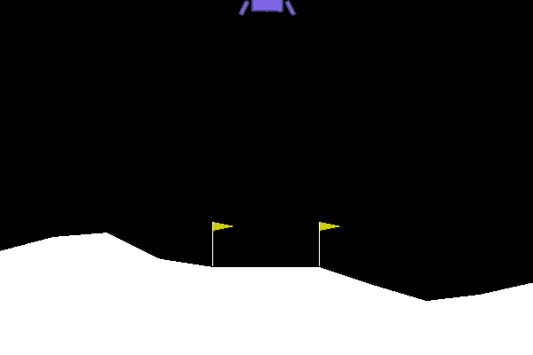
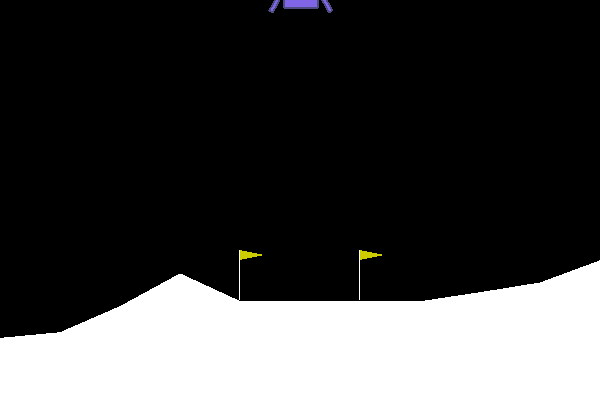
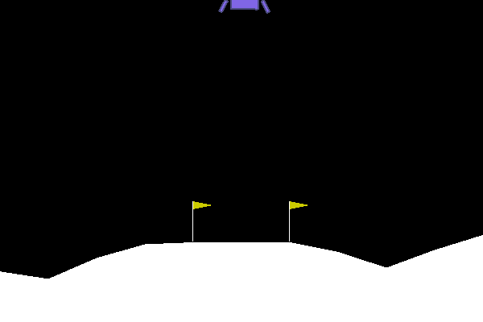
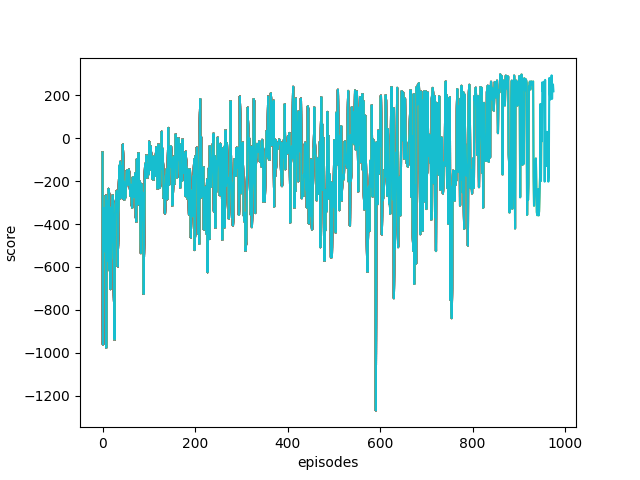

# Continuous Control with Deep Reinforcement Learning (DDPG)

This implements a reinforcement learning algorithm [DDPG](https://arxiv.org/abs/1509.02971).

|Episode: 0|Episode: 500|Episode: 900|
|---|---|---|
||||

# Score Graph for `LunarLanderContinuous-v2`

## Environments

* Pytorch 1.7
* Python 3.8

Please refer `requirements.txt` for python packages for this repo.
